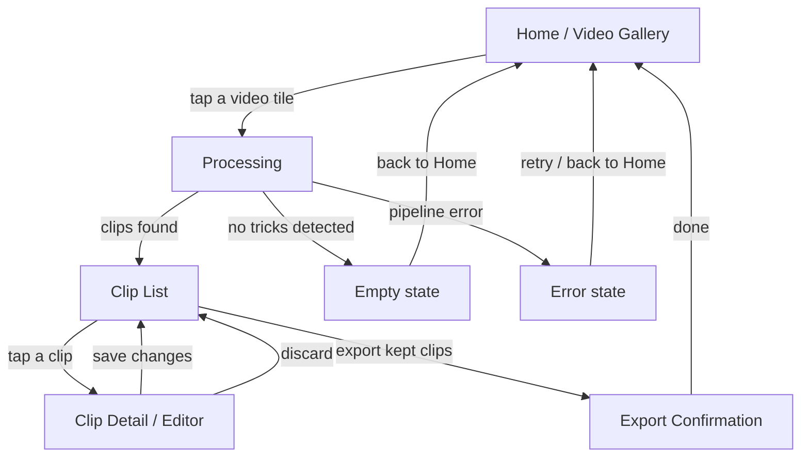

# Turnip — UI/UX Flow (v1 MVP)

*Rev 1 · 2026-09-04 · Draft for review.*

Companion to [`DESIGN.md`](DESIGN.md), which specifies the auto-edit *pipeline*
(pose detection → motion signal → peak detection → crop rect → export). This
doc specifies the *screens* the v1 app needs to carry a user from "I have a
recording" to "clips are in my Photos library," and is scoped to v1
(auto-clip + auto-crop, iOS-only, on-device). It does not cover v2 (community
labeling, following/feed, Share Sheet, OTA models) — those get their own flow
notes once the v1 screens exist and v2 work starts.

## Why this doc exists

`DESIGN.md`'s "Preview UI" bullet describes behavior ("thumbnail per detected
clip, tap-preview, drag-adjust start/end, keep/discard toggles") but not
screens. In practice that behavior needs at least two distinct screens — a
list/triage view and a per-clip editor — plus states DESIGN.md doesn't
mention at all: a loading state while the pipeline runs, an empty state when
no tricks are detected, and a confirmation state after export. Issue
[#11](https://github.com/hoiekim/turnip-ios/issues/11) currently bundles all
of this into one "Preview UI" issue; this doc exists to pin the flow down
before that issue gets split.

## Screen inventory

### 1. Home / Video Gallery

- Entry point *is* the picker — a 3-column grid of thumbnails covering every
  video in the device's Photos library, not a button that opens a picker
  sheet. Tapping a tile is the "pick video" action and goes straight to
  Processing for that video.
- No account, no settings required for v1 — nothing in `DESIGN.md`'s v1 scope
  needs either.
- **Technical implication worth flagging**: this is a different permission
  model from what's already built. The pose-diagnostic screen
  (`Turnip/PoseDiagnostic/PoseDiagnosticViewModel.swift`) uses
  `PhotosPickerItem` / `PHPickerViewController`, which runs out-of-process
  and needs **no** Photos permission at all. A gallery grid needs to
  enumerate every video `PHAsset` up front to render tiles, which means:
  - Full Photos library read access (`NSPhotoLibraryUsageDescription`),
    requested on first launch.
  - Handling **limited** library access (iOS lets the user grant only a
    subset of their library) — the grid should show just the granted
    videos plus a way to grant more, not silently look empty.
  - Handling **denied** access — an empty state pointing at Settings, since
    there's no picker fallback once Home itself is the gallery.
  - Thumbnail loading/caching (`PHCachingImageManager`) and pagination for
    libraries with hundreds of videos, so the grid stays scrollable and
    doesn't stall on first load.

### 2. Processing

- Shown while the full pipeline runs: frame sampling → pose inference →
  motion signal → peak detection → crop rect (per issues
  [#8](https://github.com/hoiekim/turnip-ios/issues/8)–[#9](https://github.com/hoiekim/turnip-ios/issues/9)).
  This is not instant for a multi-minute input video, so needs real progress
  feedback, not just a spinner — e.g. "analyzing frame 400/1200."
- Two exits besides success:
  - **Empty state** — pipeline completes but finds zero trick windows (e.g.
    user picked a video with no motion peaks). Message + back to Home.
  - **Error state** — pipeline throws (unreadable video, pose model failure).
    Message + retry, or back to Home.

### 3. Clip List (triage)

- One card per detected trick window: thumbnail (frame at the window's
  midpoint, per the computed crop rect), duration, keep/discard toggle.
- Tapping a card opens Clip Detail; the keep/discard toggle itself is a
  quick action that doesn't require opening detail.
- A visible "Export N clips" action, enabled once at least one clip is kept.
- This is the part of current issue #11 that's genuinely a list/grid screen.

### 4. Clip Detail / Editor

- The piece missing from #11 as currently scoped. Full-screen, one clip at a
  time:
  - Video player showing the clip trimmed + cropped as currently configured.
  - Scrub bar with drag handles on start/end (adjusts the trick window from
    issue #8's output; live-updates the crop rect per issue #9 if the window
    changes, since the crop rect is a function of which frames are in play).
  - Keep/discard toggle (mirrors the list's toggle — editing a clip you're
    about to discard should still be possible, just not required).
  - Back to Clip List commits the edits; no separate "save" step needed if
    edits are held in view state until back-navigation.

### 5. Export Confirmation

- Triggered from Clip List's "Export N clips" action. Runs issue
  [#10](https://github.com/hoiekim/turnip-ios/issues/10)'s exporter for
  every kept clip.
- Per-clip progress (export + Photos-library write can fail independently
  per clip — e.g. Photos permission revoked mid-flow).
- Final state: "N of M clips saved to Photos" with any per-clip failures
  called out individually, not just a total count. No further action
  required — user can start over from Home.

## Out of scope for this doc

- Community upload opt-in, Share Sheet ([#12](https://github.com/hoiekim/turnip-ios/issues/12)),
  OTA model updates ([#13](https://github.com/hoiekim/turnip-ios/issues/13)) —
  all v2, layered onto this flow later (most likely: a Share action added to
  Clip Detail and/or Export Confirmation once #12 lands).
- Settings screen — nothing in v1 scope needs configurable state (aspect
  ratio, buffer duration) beyond the per-clip adjustment already covered by
  Clip Detail's drag handles.
- Visual design (colors, typography, exact layout) — this doc fixes screens
  and transitions, not pixels.

## Open questions

1. **Crop rect editing** — Clip Detail lets the user adjust the trim window;
   does it also expose direct crop-rect adjustment (drag the box), or is the
   crop rect always derived from the trim window per issue #9's algorithm
   with no manual override in v1? Leaning toward no manual override for v1 —
   keeps Clip Detail simpler — but flagging since `DESIGN.md` doesn't say.
2. **Multi-select in Clip List** — is keep/discard purely per-card, or is
   there a "discard all" / "keep all" bulk action once clip counts get high
   (a long recording session could produce 10+ trick windows)?
3. **Processing screen navigation** — can the user cancel a long-running
   pipeline run and go back to Home, or must they wait it out?
