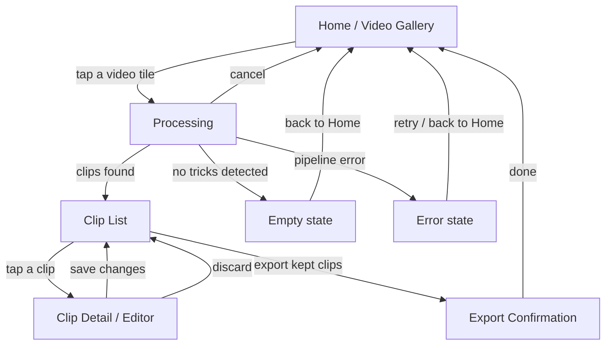

# Turnip — UI/UX Flow (v1 MVP)

*Rev 2 · 2026-09-04 · Draft for review.*

*(Rev 1 established the five-screen flow and made Home a Photos video gallery. Rev 2 resolves the three open questions into decisions.)*

Companion to [`DESIGN.md`](DESIGN.md), which specifies the auto-edit *pipeline*
(pose detection → motion signal → peak detection → crop rect → export). This
doc specifies the *screens* the v1 app needs to carry a user from "I have a
recording" to "clips are in my Photos library," and is scoped to v1
(auto-clip + auto-crop, iOS-only, on-device). It does not cover v2 (community
labeling, following/feed) — those get their own flow notes once the v1 screens
exist and v2 work starts. The Share Sheet and OTA models were scoped here as v2
and have since been built ahead of that; see "Built ahead of this doc" below.

## Why this doc exists

`DESIGN.md`'s "Preview UI" bullet describes behavior ("thumbnail per detected
clip, tap-preview, drag-adjust start/end, keep/discard toggles") but not
screens. In practice that behavior needs at least two distinct screens — a
list/triage view and a per-clip editor — plus states DESIGN.md doesn't
mention at all: a loading state while the pipeline runs, an empty state when
no tricks are detected, and a confirmation state after export. Issue
[#11](https://github.com/hoiekim/turnip-ios/issues/11) currently bundles all
of this into one "Preview UI" issue; this doc exists to pin the flow down
before that issue gets split.

## Screen inventory

### 1. Home / Video Gallery

- Entry point *is* the picker — a 3-column grid of thumbnails covering every
  video in the device's Photos library, not a button that opens a picker
  sheet. Tapping a tile is the "pick video" action and goes straight to
  Processing for that video.
- No account, no settings required for v1 — nothing in `DESIGN.md`'s v1 scope
  needs either.
- **Permission model** (shipped, in `Turnip/Home/`): because Home *is* the
  gallery, it enumerates video `PHAsset`s itself rather than delegating to
  an out-of-process picker, so it needs real Photos access. As built:
  - Read/write authorization (`NSPhotoLibraryUsageDescription`) requested
    on first launch, via `PHPhotoLibrary.requestAuthorization(for:)`.
  - **Limited** access shows the granted videos plus a banner opening
    `presentLimitedLibraryPicker`, rather than looking empty.
  - **Denied** or restricted access shows an empty state pointing at
    Settings, since there is no picker fallback once Home is the gallery.
  - Thumbnails come from a `PHCachingImageManager` prefetching around the
    visible rows, over 60-asset pages, so a library with hundreds of
    videos scrolls without stalling on first load.

### 2. Processing

- Shown while the full pipeline runs: frame sampling → pose inference →
  motion signal → peak detection → crop rect (per issues
  [#8](https://github.com/hoiekim/turnip-ios/issues/8)–[#9](https://github.com/hoiekim/turnip-ios/issues/9)).
  This is not instant for a multi-minute input video, so needs real progress
  feedback, not just a spinner — e.g. "analyzing frame 400/1200."
- Two exits besides success:
  - **Empty state** — pipeline completes but finds zero trick windows (e.g.
    user picked a video with no motion peaks). Message + back to Home.
  - **Error state** — pipeline throws (unreadable video, pose model failure).
    Message + retry, or back to Home.

### 3. Clip List (triage)

- One card per detected trick window: thumbnail (frame at the window's
  midpoint, per the computed crop rect), duration, keep/discard toggle.
- Tapping a card opens Clip Detail; the keep/discard toggle itself is a
  quick action that doesn't require opening detail.
- A visible "Export N clips" action, enabled once at least one clip is kept.
- This is the part of current issue #11 that's genuinely a list/grid screen.

### 4. Clip Detail / Editor

- The piece missing from #11 as currently scoped. Full-screen, one clip at a
  time:
  - Video player showing the trimmed clip looping, cropped to the 9:16 export framing
    by default — what the user sees is what the export produces (issue #88). A "Show
    full frame" toggle switches to the whole landscape frame with the live crop rect
    drawn over it; the dimmed surround marks what export cuts away, for surrounding
    context while trimming.
  - Scrub bar with drag handles on start/end (adjusts the trick window from
    issue #8's output; live-updates the crop rect per issue #9 if the window
    changes, since the crop rect is a function of which frames are in play).
  - Keep/discard toggle (mirrors the list's toggle — editing a clip you're
    about to discard should still be possible, just not required).
  - Back to Clip List commits the edits; no separate "save" step needed if
    edits are held in view state until back-navigation.

### 5. Export Confirmation

- Triggered from Clip List's "Export N clips" action. Runs issue
  [#10](https://github.com/hoiekim/turnip-ios/issues/10)'s exporter for
  every kept clip.
- Per-clip progress (export + Photos-library write can fail independently
  per clip — e.g. Photos permission revoked mid-flow).
- Final state: "N of M clips saved to Photos" with any per-clip failures
  called out individually, not just a total count. No further action
  required — user can start over from Home.

## Out of scope for this doc

- Accessibility acceptance criteria per screen — those live in
  [`ACCESSIBILITY.md`](ACCESSIBILITY.md) (issue #22) and are checked on each screen's PR.
- Community upload opt-in — v2, layered onto this flow later.
- Settings screen — nothing in v1 scope needs configurable state (aspect
  ratio, buffer duration) beyond the per-clip adjustment already covered by
  Clip Detail's drag handles.
- Visual design (colors, typography, exact layout) — this doc fixes screens
  and transitions, not pixels.

## Built ahead of this doc

Two features this doc scoped as v2 are on `main` already, so a contributor
should start from that code rather than design it again. One of them a user can
already reach:

- **Share Sheet** — `Turnip/Sharing/ClipShareButton.swift`, placed on each row
  of Export Confirmation, which the flow above now reaches from Home. The Share
  action disables itself unless the URL is a file URL that exists when the row
  renders; that check is a render-time snapshot rather than an invariant, so
  the caller owns the file's lifetime from then on.
- **OTA model updates** — `Turnip/ModelUpdates/`: a manifest client, a version
  store with atomic replace, and a service that no-ops when no endpoint is
  configured, which is the case today. No screen this doc specifies surfaces
  it, no app code constructs it, and the doc does not yet say where one would
  go.

## Decisions (formerly open questions)

Resolved 2026-09-04.

1. **Crop rect editing → No manual override in v1.** The crop rect is always
   derived from the trim window per issue #9's algorithm; adjusting the trim
   handles in Clip Detail re-derives it. Keeps Clip Detail to one gesture
   surface. *Reopen if:* real-footage testing (#2) shows the auto-crop is
   wrong often enough that users need to fix it by hand.
2. **Bulk keep/discard → Not in v1.** Every clip defaults to "kept"; a user
   discards by tapping individual cards. At ~10 clips per session that's a
   few taps. Add "discard all" only if feedback asks for it.
3. **Cancel during processing → Yes.** Processing (#17) exposes a cancel
   action that returns to Home. It's nearly free with structured concurrency
   (cooperative `Task.isCancelled` checks in the frame-sampler loop, tracked
   in #21), and users will background or leave the screen anyway — a clean
   cancel beats a stuck screen. The flow diagram's `Processing → Home` edge
   covers this path.
4. **Preview framing → Cropped by default, with a full-frame toggle.** Recorded
   2026-09-14 (issue #88), answering the orientation note on issue #18
   (2026-09-05): the editor's player shows the cropped 9:16 framing by default,
   since most v1 footage is landscape from tripod-mounted phones and judging the
   export through the uncropped preview's narrow crop hole hid what the auto-crop
   cut away. A toggle shows the full landscape frame with the crop rect overlaid
   for surrounding context while trimming. *Reopen if:* real-footage testing (#2)
   shows users trim more accurately with the full frame up front, or the extra
   tap costs more certainty than it buys.
