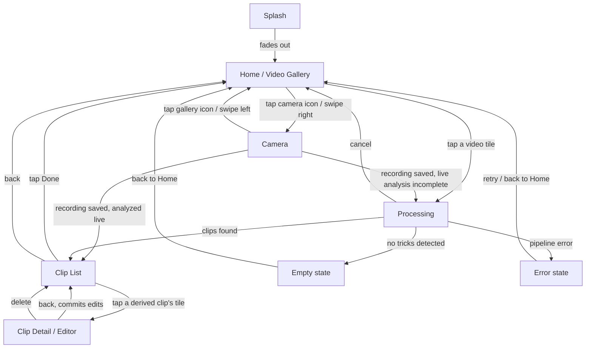

# Turnip — UI/UX Flow (v1 MVP)

*Rev 3 · 2026-09-23 · Draft for review.*

*(Rev 1 established the five-screen flow and made Home a Photos video gallery. Rev 2 resolves the three open questions into decisions. Rev 3 adds the Settings screen this doc previously scoped out.)*

Companion to [`DESIGN.md`](DESIGN.md), which specifies the auto-edit *pipeline*
(pose detection → motion signal → peak detection → crop rect → export). This
doc specifies the *screens* the v1 app needs to carry a user from "I have a
recording" to "clips are in my Photos library," and is scoped to v1
(auto-clip + auto-crop, iOS-only, on-device). It does not cover v2 (community
labeling, following/feed) — those get their own flow notes once the v1 screens
exist and v2 work starts. OTA model updates were scoped here as v2 and have
since been built ahead of that; see "Built ahead of this doc" below.

## Why this doc exists

`DESIGN.md`'s "Preview UI" bullet describes behavior ("thumbnail per detected
clip, tap-preview, drag-adjust start/end, keep/discard toggles") but not
screens. In practice that behavior needs at least two distinct screens — a
list/triage view and a per-clip editor — plus states DESIGN.md doesn't
mention at all: a loading state while the pipeline runs, an empty state when
no tricks are detected, and a confirmation state after export. Issue
[#11](https://github.com/hoiekim/turnip-ios/issues/11) currently bundles all
of this into one "Preview UI" issue; this doc exists to pin the flow down
before that issue gets split.

## Screen inventory

The whole app forces dark appearance (`.preferredColorScheme(.dark)` in
`ContentView`) — black backgrounds throughout, no light-mode variant. This is
a v1 product decision (see "Decisions" below), not a per-screen choice.

### 0. Splash

`Turnip/App/SplashScreenView.swift`: the app mark centered on black.
`ContentView` shows it as an overlay for a fixed beat on launch, then
cross-fades it out to reveal the root tab view underneath — a timer, not a
readiness signal, so it never depends on how long the Photos fetch takes.

### Root navigation

`Turnip/App/RootTabView.swift` hosts the app's two pages — Camera and Home
— in a swipeable `TabView` (`.page` style, native page dots hidden), with a
custom floating pill bar overlaid at the bottom rather than the system tab
bar: camera icon on the left, gallery-grid icon on the right, gallery
selected by default. Tapping an icon or swiping the page (right reveals
Camera, since it's the page before Home) both drive the same selection
state. It also owns the one `VideoLibraryViewModel` shared by both pages —
a finished recording needs to hand its asset into the same
`select(_:)` a tapped gallery tile calls, then switch back to the gallery
tab so the pick lands the way tapping a tile always has.

The pill is a true overlay, not a safe-area inset — the gallery grid scrolls
underneath it rather than stopping short, so it reads as floating over the
tiles instead of a docked bar. It renders in Liquid Glass on iOS 26+
(`.ultraThinMaterial` below that), and only while Home's own grid is the
visible screen: it's hidden on the Camera page (which has its own cancel
chevron back to Home) and hidden the moment Home pushes into
Processing/ClipList/ClipEditor, reappearing once back at the grid.

### 1. Home / Video Gallery

Entry point *is* the picker — every video in the device's Photos library, not
a button that opens a picker sheet. No account, no settings required for v1
— nothing in `DESIGN.md`'s v1 scope needs either. An ordinary full-screen
scrollable grid (`Turnip/Home/HomeView.swift`, `VideoGalleryView`), newest
videos first, top-to-bottom, three columns. The "Turnip" wordmark (app mark
beside the title, the mark 1.2x the title text's height) heads the grid as
scroll content, so it scrolls away with the tiles rather than floating over
them, and the tiles run under the status bar. Home's nav bar is empty,
transparent, and takes no space: the content ignores the band the bar would
reserve, so at rest the wordmark sits directly under the status bar with no
empty gap above it. The bar exists only so iOS 26 draws its scroll-edge glass
over the status bar and that band as tiles pass beneath, the same blur Clip
List gets from its titled bar: its only content is an invisible title text,
because nothing else draws a real blur (a hidden bar or a `safeAreaBar`
standing in for one gets no glass at all, and a non-text bar item only a dim
gradient). The glass stays hidden until the content actually scrolls, since
the header rests inside the bar's band — no custom landing state, no
swipe-to-reveal. Tapping a tile goes straight to Processing for that video.

**Permission model** (shipped, in `Turnip/Home/`): because Home *is* the
gallery, it enumerates video `PHAsset`s itself rather than delegating to an
out-of-process picker, so it needs real Photos access. As built:
- Read/write authorization (`NSPhotoLibraryUsageDescription`) requested
  on first launch, via `PHPhotoLibrary.requestAuthorization(for:)`.
- **Limited** access shows the granted videos plus a banner opening
  `presentLimitedLibraryPicker`, rather than looking empty.
- **Denied** or restricted access shows an empty state pointing at
  Settings, since there is no picker fallback once Home is the gallery.
- Thumbnails come from a `PHCachingImageManager` prefetching around the
  visible rows, over 60-asset pages, so a library with hundreds of
  videos scrolls without stalling on first load.

### 1a. Settings

- Reached by tapping the gear icon floating at Home's top-trailing corner (the same
  `ScrimIconButton` corner-overlay shape Camera's own controls use), attached outside the band
  `HomeNavigationBar` reserves for its own system `UINavigationBar`. That bar is visually
  transparent (`.toolbarBackground(.hidden, ...)`, for the iOS 26 scroll-edge glass described
  under "1. Home / Video Gallery" above) but still hit-tests its own frame ahead of SwiftUI
  content drawn under it — a scroll-content placement inside that band was tried first and
  shipped unreachable on a real device despite passing every static check (touch-target size,
  accessibility identifier, screenshot coverage), none of which exercises real hit-testing
  against a system nav bar. The floating placement's own tradeoff: at the grid's resting scroll
  position the gear's fixed rect sits over the top-right tile, not just "sometimes" over
  whatever scrolls up — same acceptance Camera's own corner controls already have over its
  viewfinder. Presented as a sheet, not pushed onto the flow's `NavigationStack`: it has nothing
  to hand back to Home and isn't part of "pick a video, get clips."
- Four preferences, `UserDefaults`-backed (`Turnip/Settings/TurnipSettingsStore.swift`), each
  taking effect at its own integration point rather than needing a restart:
  - **Analysis mode** (segmented Real-time / Offline) — whether the camera scores pose live while
    recording (§1b below) or always defers to Processing (§2). Real-time is the default.
  - **Save to an album**, with a name field shown once it's on — whether Clip List's Done action
    (§3) adds each saved clip to a named Photos album (created on first use) instead of landing
    with no album, the default. Scoped to the curated clip exports only: a camera recording's raw
    take, saved to Photos the moment recording stops (§1b), never goes in the album.
  - **Analysis granularity** (stepper, 1-30, default 10) — frames sampled per second of footage,
    replacing the fixed rate `docs/DESIGN.md`'s "Performance targets" describes; both the file
    path and the live path (§1b) sample at this rate.
- Further settings beyond these four are out of scope for this doc's current revision.

### 1b. Camera

- One of the root tab view's two pages (see "Root navigation" above), not a
  modal — reached by tapping the floating bar's camera icon or swiping the
  page right from Home. Minimal v1 scope: full-screen back-camera preview, a
  cancel chevron (switches back to the gallery tab), and one record button
  (tap to start, tap again to stop) — no flip camera, flash, or zoom
  (`Turnip/Camera/`).
- Needs `NSCameraUsageDescription` and `NSMicrophoneUsageDescription`
  (Info.plist); denied/restricted access shows a message pointing at
  Settings, matching Home's own denied state.
- While recording, pose inference runs on the live camera frames and the
  scored skeleton is drawn over the preview (`docs/LIVE_POSE.md`).
- A finished recording is saved to the Photos library (via the same
  `ClipPhotosSaver` Clip List uses) rather than kept as a private file —
  that turns it into an ordinary `PHAsset`, so it re-enters the flow the
  way a tapped gallery tile does: `RootTabView` calls
  `VideoLibraryViewModel.select(_:detectedClips:)` on the newly-created
  asset and switches to the gallery tab. When live inference covered the
  whole take, its clips travel with the selection and the take lands on
  Clip List directly (§3) with no analysis step; otherwise it lands on
  Processing's idle state exactly as if the user had tapped a tile.

### 2. Processing

- The pipeline does not auto-start, but the picked video does: it fills the
  screen (fit to the screen, no native playback chrome) and starts playing
  automatically on arrival, Photos-app style — no tap needed to see it. A thin
  scrub bar (play/pause, seek, mute) draws over the bottom, with a large,
  full-width "Start analysis" button below it — black background, no title,
  no caption text, back chevron to Home. The user watches the autoplaying
  video, pausing/scrubbing it via the scrub bar if they want, and starts
  analysis when ready.
- Once started, the video stays on screen (paused) rather than being replaced
  by a separate page: a progress panel — spinner or determinate bar, plus
  "analyzing frame 400/1200" — overlays the bottom of the still-visible video,
  dimmed behind it. This is not instant for a multi-minute input video, so
  needs real progress feedback, not just a spinner.
- Two exits besides success:
  - **Empty state** — pipeline completes but finds zero trick windows (e.g.
    user picked a video with no motion peaks). Message + back to Home.
  - **Error state** — pipeline throws (unreadable video, pose model failure).
    Message + retry, or back to Home.
- A swipe here navigates the grid rather than reaching Camera: right browses
  to the previous video in Home's grid order, left to the next, replacing the
  screen in place (not stacking a new one, so the back chevron still returns
  to Home in one step) — disabled while an analysis is running. The whole
  page — video, back chevron and bottom controls — follows the finger, and
  the neighbor's page slides in alongside it showing that video's poster
  frame, the way the Camera page arrives over Home; once it has landed, its
  player takes over from the poster in place. A drag that falls short springs
  back, a quick flick commits even when short, and at either end of the grid
  the page gives only a little, since there is no video that way. Where the
  drag starts makes no difference — the leading edge, the top band, the
  bottom strip, the chevron itself — with one carve-out: the scrub bar's own
  track (see its section below), which claims a horizontal drag for
  scrubbing. Two things make that hold. This screen draws no navigation bar
  and its own back chevron, because the stack's bar would sit over the page,
  neither moving with it nor passing a drag to it, and the system back button
  is what the edge-swipe-to-pop rides on. And the Camera/Home pager (§1) is
  switched off while any screen is pushed over Home, because its swipe would
  otherwise take every horizontal drag before this screen saw it.

### 3. Clip List (triage)

- A grid of square tiles: the original source video first, then one tile per
  detected trick window, then a trailing "+" tile (grey square, centered plus
  sign) that appends a new full-frame clip at the start of the asset for the
  user to trim.
- Every tile autoplay-loops its window inline continuously (accessibility
  permitting), layered over its poster thumbnail so there's no blank flash
  while the loop starts. A derived clip's tile also draws a thin, read-only
  timeline over its bottom edge: it spans the whole source video with the
  clip's window drawn as a highlighted segment, so a glance at the grid shows
  roughly which part of the video each clip is from. It isn't draggable —
  trimming happens in the editor (§4). The original tile has no timeline,
  since its window is the whole video.
- One control overlays each tile's top-trailing corner: a trash button,
  filled red while trashed. Trashing a derived clip removes its tile from
  the grid immediately, with no restore. Trashing the original tile is a
  reversible toggle — tap again to restore it — that marks the source video
  itself for deletion from Photos once Done runs.
- Tapping a derived clip's tile opens the full Clip Detail / Editor (§4)
  directly — the single entry point into "view large" and "edit," not a
  separate pencil icon. The original tile isn't tappable — there's nothing
  to edit on the source video.
- A "Done" action, always enabled: exports and saves every non-trashed
  derived clip to Photos, deletes the original video from Photos if its tile
  was trashed, and pops back to Home. A full-screen spinner covers the grid
  while this runs. The original is deleted only once every derived clip has
  confirmed it saved — a clip that fails leaves the original alone and shows
  an alert naming the failure, so Done can be retried without risking the
  user's only copy of a trick that never actually saved.
- The back chevron pops to Home, not to Processing; the title sits centered
  inline on the same line as the chevron, Photos-app style.

### 4. Clip Detail / Editor

- Reached by tapping a derived clip's tile in Clip List (§3) — the tile's
  single detail entry point, not a separate pencil icon. Full-screen, one
  clip at a time:
  - Video player showing the trimmed clip looping, full frame, with the crop area's
    marker rectangle drawn over it at a fixed position — the dimmed surround marks
    what export cuts away. No default AVKit playback chrome; the only controls this
    screen shows are the custom play/pause and mute buttons and the scrub bar below.
  - The crop area is directly editable: pinch to zoom, rotate with two fingers, and
    drag with one finger to reposition the video underneath the fixed marker
    rectangle — the video zooms/rotates/moves, the marker never does. A "Reset crop
    area" button discards the manual adjustment and returns to the algorithm's own
    framing (issue #9).
  - Scrub bar spanning the whole source video (not a zoomed range around the
    window) with drag handles on start/end — adjusts the trick window from
    issue #8's output; live-updates the crop rect per issue #9 if the window
    changes, since the crop rect is a function of which frames are in play. The
    manual crop adjustment above is independent of this and survives a trim.
    Full-video handles are naturally imprecise on a long clip, so dragging
    farther vertically from the track slows the handle down (common
    photo/video trim gesture): near the track it tracks the touch 1:1; drag
    away and the same finger movement moves it a smaller fraction of the way,
    for fine control. Moving back to the track snaps to full speed again.
  - A Delete button at the top-right corner removes the clip from the list
    entirely — the same removal the list's own trash button already performs
    on a derived clip's tile (§3). Trashing stays a reversible toggle only
    for the original tile.
  - Back to Clip List commits the edits; no separate "save" step needed if
    edits are held in view state until back-navigation.

## Out of scope for this doc

- Accessibility acceptance criteria per screen — those live in
  [`ACCESSIBILITY.md`](ACCESSIBILITY.md) (issue #22) and are checked on each screen's PR.
- Community upload opt-in — v2, layered onto this flow later.
- Further Settings options beyond the four §1a covers — aspect ratio, buffer
  duration, and whatever else a future issue asks for stay out of scope until
  one does; the per-clip crop/trim adjustment in Clip Detail's drag handles
  already covers per-clip framing without a setting.
- Visual design (colors, typography, exact layout) — this doc fixes screens
  and transitions, not pixels.

## Built ahead of this doc

One feature this doc scoped as v2 is on `main` already, so a contributor
should start from that code rather than design it again:

- **OTA model updates** — `Turnip/ModelUpdates/`: a manifest client, a version
  store with atomic replace, and a service that no-ops when no endpoint is
  configured, which is the case today. No screen this doc specifies surfaces
  it, no app code constructs it, and the doc does not yet say where one would
  go.

A Share Sheet action lived briefly on the Export Confirmation screen this doc
used to specify as §5, retired 2026-09-22 (see decision 6 below). It went with
that screen rather than moving to Clip List, since saving now happens inline
without an intermediate confirmation row to attach a Share action to.

## Decisions (formerly open questions)

Resolved 2026-09-04.

1. **Crop rect editing → Manual override added.** Reopened: the auto-crop stopped
   the trick's landing early often enough (and missed the frame often enough on
   some angles) that users need to fix the crop by hand. Clip Detail now supports
   pinch/rotate/drag directly on the crop area, on top of the algorithm's own
   framing, with "Reset crop area" to undo it. The trim handles still re-derive
   the base crop rect from the window; the manual adjustment composes with that
   rather than replacing it.
2. **Bulk keep/discard → Not in v1.** Every clip defaults to "kept"; a user
   discards by tapping individual cards. At ~10 clips per session that's a
   few taps. Add "discard all" only if feedback asks for it.
3. **Cancel during processing → Yes.** Processing (#17) exposes a cancel
   action that returns to Home. It's nearly free with structured concurrency
   (cooperative `Task.isCancelled` checks in the frame-sampler loop, tracked
   in #21), and users will background or leave the screen anyway — a clean
   cancel beats a stuck screen. The flow diagram's `Processing → Home` edge
   covers this path.
4. **Preview framing → Superseded by direct crop editing.** Recorded 2026-09-14
   (issue #88): the editor's player showed the cropped 9:16 framing by default
   with a "Show full frame" toggle for context while trimming. Once the crop area
   became directly editable (decision 1, above), the full frame with the crop
   marker overlaid had to be the only view — the toggle and the cropped-only view
   are both gone, replaced by "Reset crop area."
5. **In-app camera + dark-only theme → Added.** Recorded 2026-09-19: v1 no
   longer requires every video to already be in the Photos library before
   Turnip can see it — Home's swipe-up affordance starts a minimal in-app
   camera (§1b), and a recording is saved to Photos and handed to the
   existing `PHAsset` pipeline unchanged. Home also gained the
   collapsed/expanded two-state layout (§1) and the app forces dark
   appearance everywhere, dropping light-mode support.
6. **Export Confirmation retired; Clip List saves inline → Changed.** Recorded
   2026-09-22: the separate Export Confirmation screen (formerly §5) is gone.
   Clip List's "Done" action now exports and saves every non-trashed derived
   clip directly, with a full-screen spinner while it runs — no per-clip
   progress rows, no summary screen, no Share action. Clip List also gained a
   tile for the original source video (always first), and the per-card
   keep/discard toggle became a trash toggle that applies to any tile,
   including the original: trashing the original marks it for deletion from
   Photos, which Done carries out once every derived clip has confirmed it
   saved. The "Select All" / "Deselect All" toolbar action is gone along with
   the keep/discard concept it bulk-toggled.
7. **Camera takes skip Processing → Added.** Recorded 2026-09-23: the camera
   scores pose on its live frames while recording and draws the skeleton on
   the preview; when that covered the whole take, the same trick detection
   Processing runs is applied to the live results and the take lands on Clip
   List straight from Stop. A take live inference could not cover end to end
   (model still loading, device throttling, samples shed) still lands on
   Processing's idle state, so the fallback is never worse than before.
   Tapped gallery tiles are unchanged.
