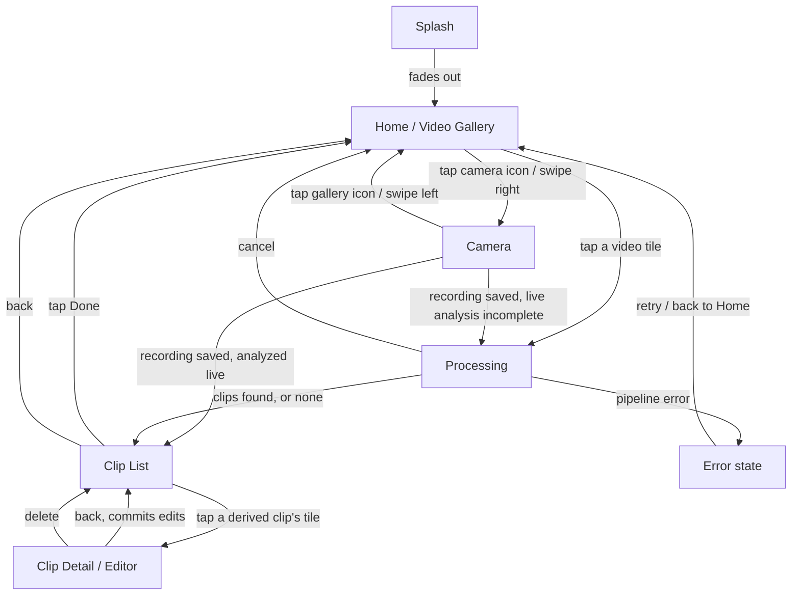

# Turnip — UI/UX Flow (v1 MVP)

*Rev 9 · 2026-10-07 · "Auto crop" pads the body parts' box by a tenth
rather than a quarter, and keeps the crop inside the video: its footprint
is slid into the frame, or zoomed to the frame's edge when it can't fit.*

*(Rev 1 established the five-screen flow and made Home a Photos video gallery. Rev 2 resolves the three open questions into decisions. Rev 3 adds the Settings screen this doc previously scoped out. Rev 4 adds the expansion transition, with the *how* in its own companion doc. Rev 5 adds "A gesture and its button play one animation." Rev 6 replaces the Clip Editor's "Reset crop area" with Auto crop and Auto rotate. Rev 7 adds "An automatic change moves, it never cuts." Rev 8 stops trimming from re-cropping. Rev 9 tightens Auto crop's padding and keeps its crop inside the video.)*

Companion to [`DESIGN.md`](DESIGN.md), which specifies the auto-edit *pipeline*
(pose detection → motion signal → peak detection → crop rect → export), and to
[`EXPANSION_TRANSITIONS.md`](EXPANSION_TRANSITIONS.md), which specifies *how*
the tap-to-expand/collapse animation two of this doc's navigations use actually
works — this doc only specifies *that* it happens. This doc specifies the
*screens* the v1 app needs to carry a user from "I have a
recording" to "clips are in my Photos library," and is scoped to v1
(auto-clip + auto-crop, iOS-only, on-device). It does not cover v2 (community
labeling, following/feed) — those get their own flow notes once the v1 screens
exist and v2 work starts. OTA model updates were scoped here as v2 and have
since been built ahead of that; see "Built ahead of this doc" below.

## Why this doc exists

`DESIGN.md`'s "Preview UI" bullet describes behavior ("thumbnail per detected
clip, tap-preview, drag-adjust start/end, keep/discard toggles") but not
screens. In practice that behavior needs at least two distinct screens — a
list/triage view and a per-clip editor — plus states DESIGN.md doesn't
mention at all: a loading state while the pipeline runs, an empty state when
no tricks are detected, and a confirmation state after export. Issue
[#11](https://github.com/hoiekim/turnip-ios/issues/11) currently bundles all
of this into one "Preview UI" issue; this doc exists to pin the flow down
before that issue gets split.

## A gesture and its button play one animation

Whenever a gesture and a control lead to the same place, they play the same
transition: the same motion, in the same direction, over the same geometry.
The control plays the animation that the gesture would have driven, from
start to finish. It never cuts, cross-fades or pushes when the gesture
slides, grows or shrinks.

The motion is how the user learns where a screen lives. A swipe teaches
"Camera is to the left of Home." A tile that grows into Processing teaches
"this screen *is* that video, enlarged." If the button for the same move
then cuts straight to the destination, the button teaches nothing and
contradicts what the gesture taught. The user ends up with two mental models
of one layout, and the button reads as a glitch.

How it's built: each transition has a single entry point that both the
gesture and the control call. The control never reaches into the state some
other way. A gesture can control the motion's progress directly (it follows
the finger and can be cancelled), and a control plays that same motion all
the way through on its own. Only who drives the progress differs. The
destination and the motion are the same.

Where it applies today:

| Transition | Gesture | Control | Shared motion |
|---|---|---|---|
| Home ↔ Camera (Root navigation) | Horizontal page swipe | Floating bar's camera / gallery icons; Camera's cancel chevron | The pager's horizontal slide (`RootTabView.slide(to:)`) |
| Tile ↔ Processing (§1, §2) | Swipe down outside the video surface | Back chevron | The tile's expansion card shrinking back into the tile ([`EXPANSION_TRANSITIONS.md`](EXPANSION_TRANSITIONS.md)) |
| Clip List tile ↔ Clip Editor (§3, §4) | Swipe down outside the crop stage | Back chevron | Same, with the card showing the editor's own player |

Not every state change has a gesture counterpart that it owes an animation.
A recording that finishes on Camera switches to Home *instantly*, because the
same update opens the expansion cover over Home, and a page still sliding
underneath would hand the cover's flight a moving source frame. The user
sees the expansion, not the page change. That switch is the result of an
operation finishing, not a navigation the user chose, so there is no gesture
whose motion it would contradict.

New screens follow the same rule: if a screen can be reached both ways,
build the gesture's transition first and route the button through it.

## An automatic change moves, it never cuts

When the app changes something on the user's behalf that the user could
have changed by hand — a fit, a reset, a re-framing, a reorder — the screen
moves continuously from where it is to the result. It never cuts. The
change travels along the same geometry the hand gesture would have driven:
a fit that zooms, turns and shifts the video plays as a zoom, a turn and a
shift, over an easing curve, not as a new picture replacing the old one.

A cut tells the user *that* something changed and nothing else. The motion
tells them *what* changed and *by how much*: a horizon that visibly turns
five degrees to level teaches what Auto rotate measured, and a crop that
visibly pulls in around the athlete teaches what Auto crop found. It also
keeps the result reversible in the user's head — they saw where the video
came from, so they know what pulling it back by hand would mean. A cut
reads as the app having replaced their work; a motion reads as the app
having adjusted it.

How it's built: the automatic change writes the same state the gesture
writes, inside an animated transaction. Nothing else differs — no
separate animated path, no snapshot cross-fade. A result that arrives
asynchronously (a detection that had to sample frames) animates when it
lands, from whatever the state is at that moment.

Where it applies today:

| Change | By hand | Automatic | Shared motion |
|---|---|---|---|
| Clip Editor crop fit (§4) | Pinch / rotate / drag the video under the marker | "Auto crop" | The video's scale, rotation and offset about the crop center, eased over 0.4 s |
| Clip Editor leveling (§4) | Two-finger rotate | "Auto rotate" | The video's rotation about the crop center, eased over 0.4 s |

This is the companion of the principle above: that one says a button plays
the gesture's *transition*; this one says an automatic change plays the
gesture's *adjustment*. Both come from the same idea — the motion is how
the user learns what the screen did.

## Screen inventory

```mermaid
flowchart TD
    S[Splash] -->|fades out| A
    A[Home / Video Gallery] -->|tap a video tile| B[Processing]
    A -->|tap camera icon / swipe right| G[Camera]
    G -->|tap gallery icon / swipe left| A
    G -->|recording saved, analyzed live| C
    G -->|recording saved, live analysis incomplete| B
    B -->|clips found, or none| C[Clip List]
    B -->|pipeline error| E2[Error state]
    B -->|cancel| A
    E2 -->|retry / back to Home| A
    C -->|tap a derived clip's tile| D[Clip Detail / Editor]
    D -->|back, commits edits| C
    D -->|delete| C
    C -->|tap Done| A
    C -->|back| A
```

The whole app forces dark appearance (`.preferredColorScheme(.dark)` in
`ContentView`) — black backgrounds throughout, no light-mode variant. This is
a v1 product decision (see "Decisions" below), not a per-screen choice.

### 0. Splash

`Turnip/App/SplashScreenView.swift`: the app mark centered on black.
`ContentView` shows it as an overlay for a fixed beat on launch, then
cross-fades it out to reveal the root tab view underneath — a timer, not a
readiness signal, so it never depends on how long the Photos fetch takes.

### Root navigation

`Turnip/App/RootTabView.swift` hosts the app's two pages — Camera and Home
— in a swipeable `TabView` (`.page` style, native page dots hidden), with a
custom floating pill bar overlaid at the bottom rather than the system tab
bar: camera icon on the left, gallery-grid icon on the right, gallery
selected by default. Tapping an icon or swiping the page (right reveals
Camera, since it's the page before Home) both drive the same selection
state *and the same motion*: a tap (or Camera's cancel chevron) pages
through `slide(to:)`, which changes the selection inside an animated
transaction. A page-style `TabView` only scrolls to a selection that changes
that way, and cuts to it otherwise. So Camera slides in from the left on a
tap exactly as it does under the finger (see "A gesture and its button play
one animation" above). It also owns the one `VideoLibraryViewModel` shared by both pages —
a finished recording needs to hand its asset into the same
`select(_:)` a tapped gallery tile calls, then switch back to the gallery
tab so the pick lands the way tapping a tile always has.

The pill is a true overlay, not a safe-area inset — the gallery grid (and
Camera's record button/lens row) scroll or sit underneath it rather than
stopping short, so it reads as floating over the content instead of a docked
bar. It renders in Liquid Glass on iOS 26+ (`.ultraThinMaterial` below that),
with a sliding selection pill behind whichever icon is active — visible on
both pages, so the pill has something to slide between on a tap or a page
swipe alike. Camera keeps its own cancel chevron too; the bar there is an
additional way back, not a replacement. It's hidden only once Home opens
Processing/ClipList/ClipEditor — a tap flies the tile into the full-screen
destination rather than pushing it (see "Tapping a tile" below and
[`EXPANSION_TRANSITIONS.md`](EXPANSION_TRANSITIONS.md)) — each of which owns
the full screen and its own back chevron, reappearing once back at the grid.

### 1. Home / Video Gallery

Entry point *is* the picker — every video in the device's Photos library, not
a button that opens a picker sheet. No account, no settings required for v1
— nothing in `DESIGN.md`'s v1 scope needs either. An ordinary full-screen
scrollable grid (`Turnip/Home/HomeView.swift`, `VideoGalleryView`), newest
videos first, top-to-bottom, three columns. The "Turnip" wordmark (app mark
beside the title, the mark 1.2x the title text's height) heads the grid as
scroll content, leading-aligned, so it scrolls away with the tiles rather
than floating over them, and the tiles run under the status bar. The filter
and settings controls sit at the trailing end of the same band — filter,
then gear. Home's nav bar is visually empty,
transparent, and takes no space: the content ignores the band the bar would
reserve, so at rest the wordmark sits directly under the status bar with no
empty gap above it. The bar exists only so iOS 26 draws its scroll-edge glass
over the status bar and that band as tiles pass beneath, the same blur Clip
List gets from its titled bar: its only content is an invisible title text,
because nothing else draws a real blur (a hidden bar or a `safeAreaBar`
standing in for one gets no glass at all, and a non-text bar item only a dim
gradient). The glass stays hidden until the content actually scrolls, since
the header rests inside the bar's band — no custom landing state, no
swipe-to-reveal. Tapping a tile flies it open, Photos-style, into Processing
for that video (straight to Clip List instead, for a camera take live
inference already covered — §1b) — the tile grows smoothly to fill the
screen rather than the screen pushing in from the side, landing on the
tile's own thumbnail immediately rather than waiting on the tap's resolve
(which can take a moment for an iCloud video) before showing any motion. The
resolve's own progress, if it takes a moment, shows on that growing card
instead of a separate loading screen. The reverse — the destination's own
back control, or a swipe down outside its video surface — shrinks the same
way back into the tile, landing on whichever tile is actually current if
Processing's own swipe-to-browse-neighbors (§2) moved on from the one first
tapped. See [`EXPANSION_TRANSITIONS.md`](EXPANSION_TRANSITIONS.md) for the
mechanics.

**Permission model** (shipped, in `Turnip/Home/`): because Home *is* the
gallery, it enumerates video `PHAsset`s itself rather than delegating to an
out-of-process picker, so it needs real Photos access. As built:
- Read/write authorization (`NSPhotoLibraryUsageDescription`) requested
  on first launch, via `PHPhotoLibrary.requestAuthorization(for:)`.
- **Limited** access shows the granted videos plus a banner opening
  `presentLimitedLibraryPicker`, rather than looking empty.
- **Denied** or restricted access shows an empty state pointing at
  Settings, since there is no picker fallback once Home is the gallery.
- Thumbnails come from a `PHCachingImageManager` prefetching around the
  visible rows, over 60-asset pages, so a library with hundreds of
  videos scrolls without stalling on first load.

**Filter** (shipped, `Turnip/Home/GalleryFilter.swift`): a `Menu` button just
before the settings gear at the header band's trailing end, mirroring the
Photos app's own filter — All Items,
Favorites, or a specific user album (nested submenu). The filter changes the
underlying `PHFetchOptions`/`PHAssetCollection` fetch itself, not a
post-filter of the loaded grid, so paging and Processing's swipe-to-browse
stay correct against the filtered set. "Edited" is not offered: PhotoKit has
no fetch-level predicate for it, only a per-asset resource scan that would
make every filter change scale with library size instead of staying
fetch-level. Dimmed and disabled without library access (denied or not yet
determined) rather than left tappable with no effect. An active (non-All
Items) filter switches the button's glyph to its filled variant and carries
the same state as the control's `accessibilityValue`, so it's never only a
visual signal. A filter matching no videos shows its own empty state ("No
matches", the filter's name, a Clear Filter button) instead of the library's
default empty state, so it never reads as "your library is empty."

### 1a. Settings

- Reached by tapping the gear icon floating at Home's top-trailing corner (the same
  `ScrimIconButton` corner-overlay shape Camera's own controls use), attached outside the band
  `HomeNavigationBar` reserves for its own system `UINavigationBar`. That bar is visually
  transparent (`.toolbarBackground(.hidden, ...)`, for the iOS 26 scroll-edge glass described
  under "1. Home / Video Gallery" above) but still hit-tests its own frame ahead of SwiftUI
  content drawn under it — a scroll-content placement inside that band was tried first and
  shipped unreachable on a real device despite passing every static check (touch-target size,
  accessibility identifier, screenshot coverage), none of which exercises real hit-testing
  against a system nav bar. The floating placement's own tradeoff: at the grid's resting scroll
  position the gear's fixed rect sits over the top-right tile, not just "sometimes" over
  whatever scrolls up — same acceptance Camera's own corner controls already have over its
  viewfinder. Presented as a sheet, not pushed onto the flow's `NavigationStack`: it has nothing
  to hand back to Home and isn't part of "pick a video, get clips."
- Four preferences, `UserDefaults`-backed (`Turnip/Settings/TurnipSettingsStore.swift`), each
  taking effect at its own integration point rather than needing a restart:
  - **Analysis mode** (segmented Real-time / Offline) — whether the camera scores pose live while
    recording (§1b below) or always defers to Processing (§2). Real-time is the default.
  - **Save to an album**, with a name field shown once it's on — whether Clip List's Done action
    (§3) adds each saved clip to a named Photos album (created on first use) instead of landing
    with no album, the default. Scoped to the curated clip exports only: a camera recording's raw
    take, saved to Photos the moment recording stops (§1b), never goes in the album.
  - **Analysis granularity** (stepper, 1-30, default 10) — frames sampled per second of footage,
    replacing the fixed rate `docs/DESIGN.md`'s "Performance targets" describes; both the file
    path and the live path (§1b) sample at this rate.
- Further settings beyond these four are out of scope for this doc's current revision.

### 1b. Camera

- One of the root tab view's two pages (see "Root navigation" above), not a
  modal — reached by tapping the floating bar's camera icon or swiping the
  page right from Home. Minimal v1 scope: full-screen back-camera preview, a
  cancel chevron (slides back to the gallery tab, the same slide a left
  swipe plays), and one record button
  (tap to start, tap again to stop) — no flip camera, flash, or zoom
  (`Turnip/Camera/`).
- Needs `NSCameraUsageDescription` and `NSMicrophoneUsageDescription`
  (Info.plist); denied/restricted access shows a message pointing at
  Settings, matching Home's own denied state.
- While recording, pose inference runs on the live camera frames and the
  scored skeleton is drawn over the preview (`docs/LIVE_POSE.md`).
- A finished recording is saved to the Photos library (via the same
  `ClipPhotosSaver` Clip List uses) rather than kept as a private file —
  that turns it into an ordinary `PHAsset`, so it re-enters the flow the
  way a tapped gallery tile does: `RootTabView` calls
  `VideoLibraryViewModel.select(_:detectedClips:)` on the newly-created
  asset and switches to the gallery tab. When live inference covered the
  whole take, its clips travel with the selection — with the scored
  frames they were cut from, which the editor's crop fits need — and the
  take lands on Clip List directly (§3) with no analysis step; otherwise it lands on
  Processing's idle state exactly as if the user had tapped a tile.

### 2. Processing

- The pipeline does not auto-start, but the picked video does: it fills the
  screen (fit to the screen, no native playback chrome) and starts playing
  automatically on arrival, Photos-app style — no tap needed to see it. A thin
  scrub bar (play/pause, seek, mute) draws over the bottom, with a large,
  full-width "Start analysis" button below it — black background, no title,
  no caption text, back chevron to Home. The user watches the autoplaying
  video, pausing/scrubbing it via the scrub bar if they want, and starts
  analysis when ready. The back chevron, and a swipe down anywhere outside
  the video surface itself (see the swipe bullet below), both shrink the
  screen back into Home's tile rather than popping or dismissing outright —
  [`EXPANSION_TRANSITIONS.md`](EXPANSION_TRANSITIONS.md) covers the mechanics
  this screen's own swipe-to-dismiss gesture now drives.
- Once started, the video stays on screen (paused) rather than being replaced
  by a separate page: a progress panel — spinner or determinate bar, plus
  "analyzing frame 400/1200" — overlays the bottom of the still-visible video,
  dimmed behind it. This is not instant for a multi-minute input video, so
  needs real progress feedback, not just a spinner.
- On success the pipeline navigates to Clip List — even a run that finds zero trick
  windows (e.g. the user picked a video with no motion peaks) still navigates there
  rather than stopping on this screen; Clip List's own "No tricks found" notice (§3)
  says so.
- One exit besides success: the **Error state** — pipeline throws (unreadable video,
  pose model failure). Message + retry, or back to Home.
- A swipe here navigates the grid rather than reaching Camera: right browses
  to the previous video in Home's grid order, left to the next, replacing the
  screen in place (not stacking a new one, so the back chevron still returns
  to Home in one step) — disabled while an analysis is running. The whole
  page — video, back chevron and bottom controls — follows the finger, and
  the neighbor's page slides in alongside it showing that video's poster
  frame, the way the Camera page arrives over Home; once it has landed, its
  player takes over from the poster in place. A drag that falls short springs
  back, a quick flick commits even when short, and at either end of the grid
  the page gives only a little, since there is no video that way. Where the
  drag starts makes no difference — the leading edge, the top band, the
  bottom strip, the chevron itself — with one carve-out: the scrub bar's own
  track (see its section below), which claims a horizontal drag for
  scrubbing. A down drag outside the video surface is the other carve-out —
  it drives the expansion transition's own interactive dismiss (shrinking
  live with the finger, landing back on Home's tile) rather than browsing.
  This screen draws no navigation bar and its own back chevron, because the
  stack's bar would sit over the page without moving with it or passing a
  drag to it. And the Camera/Home pager (§1) is switched off while this
  screen (or Clip List/Editor) is open over Home, because its swipe would
  otherwise take every horizontal drag before this screen saw it.

### 3. Clip List (triage)

- A grid of square tiles: the original source video first, then one tile per
  detected trick window, then a trailing "+" tile (grey square, centered plus
  sign) that appends a new full-frame clip at the start of the asset for the
  user to trim.
- When an analysis detected zero tricks, this screen still shows — just the
  original tile and the "+" tile — with a dismissible Liquid Glass notice
  ("No tricks found") centered over the top of the grid, tap-to-dismiss or
  auto-dismissing after 5 seconds, instead of a dead-end screen of its own.
- Every tile autoplay-loops its window inline continuously (accessibility
  permitting), layered over its poster thumbnail so there's no blank flash
  while the loop starts — cropped and rotated to match the clip's manual
  adjustment, the same framing the poster and the exported clip use, not the
  raw source frame. A derived clip's tile also draws a thin, read-only
  timeline over its bottom edge: it spans the whole source video with the
  clip's window drawn as a highlighted segment, so a glance at the grid shows
  roughly which part of the video each clip is from. It isn't draggable —
  trimming happens in the editor (§4). The original tile has no timeline,
  since its window is the whole video.
- One control overlays each tile's top-trailing corner: a trash button,
  filled red while trashed. Trashing a derived clip removes its tile from
  the grid, with no restore: the tile fades out to the background (ease-out)
  while the tiles after it slide to their new slots (ease-in-out), both over
  150ms — the editor's Delete (§4) removes the tile the same way behind its
  own fade. Trashing the original tile is a
  reversible toggle — tap again to restore it — that marks the source video
  itself for deletion from Photos once Done runs.
- The top-leading corner carries a marker, not a control: a green checkmark
  on a clip whose video is already in Photos. It has no action of its own and
  doesn't take the tap over the corner it covers — tapping there still flies
  the clip open like anywhere else on the tile. In practice it's only ever on
  screen after a Done that partially failed, which is the one state where the
  grid holds a mix of landed and still-missing clips.
- Tapping a derived clip's tile flies it open, Photos-style, into the full
  Clip Detail / Editor (§4) directly — the single entry point into "view
  large" and "edit," not a separate pencil icon — the same tap-to-expand
  transition Home uses to reach Processing
  ([`EXPANSION_TRANSITIONS.md`](EXPANSION_TRANSITIONS.md)), landing on the
  tile's own cropped thumbnail immediately rather than the screen sliding in.
  The original tile isn't tappable — there's nothing to edit on the source
  video.
- A "Done" action, always enabled: exports and saves every non-trashed
  derived clip to Photos, deletes the original video from Photos if its tile
  was trashed, and pops back to Home. A full-screen spinner covers the grid
  while this runs. The original is deleted only once every derived clip has
  confirmed it saved — a clip that fails leaves the original alone and shows
  an alert naming the failure, so Done can be retried without risking the
  user's only copy of a trick that never actually saved.
- The retry saves only what is still missing: a clip whose video already
  landed is skipped, so tapping Done again after a partial failure can't put
  a second copy of a healthy clip in the user's library. Its tile's marker is
  what says which clips those are. Once the last missing clip lands, that
  retry deletes the trashed original exactly as a clean first Done would.
  One residue the skip doesn't cover: editing a clip after a partial failure
  clears its marker, correctly, since the retrimmed clip isn't the one that
  landed — so the retry writes the new version and the pre-edit copy stays in
  Photos. Nothing in the app can take that copy back; the user deletes it in
  Photos. The app tracks no identifier for an asset it wrote, so it can't
  offer to.
- The back chevron pops to Home, not to Processing; the title sits centered
  inline on the same line as the chevron, Photos-app style. The chevron is
  the same glass circle every other screen's chevron is (`ScrimIconButton`),
  drawn in place of the bar's own wider item pill, so the control reads the
  same across the flow and lands exactly on the editor's chevron through the
  expansion cross-fade. The pop is a
  sideways slide, like any navigation pop — not a shrink back into the
  video's tile, since this screen's tiles are the clips cut from the video,
  not the video itself (`EXPANSION_TRANSITIONS.md`, Rev 9).

### 4. Clip Detail / Editor

- Reached by tapping a derived clip's tile in Clip List (§3) — the tile's
  single detail entry point, not a separate pencil icon. Full-screen, one
  clip at a time:
  - Video player showing the trimmed clip looping under the crop marker: one
    rectangle of the export's aspect ratio, the same size at the same place on screen
    for every clip, centered in the band between the header row and the controls.
    The video is laid out so the clip's crop rect fills the marker exactly — a
    different clip, or an adjustment to the framing, moves and scales the video,
    never the marker — and the rest of the frame shows dimmed around it, edge to
    edge, running under the header and the controls rather than clipped to a box.
    The marker is what export cuts to. No default AVKit playback chrome; the only
    controls this screen shows are the custom play/pause and mute buttons and the
    scrub bar below.
  - The crop area is directly editable: pinch to zoom, rotate with two fingers, and
    drag with one finger to reposition the video underneath the fixed marker
    rectangle — the video zooms/rotates/moves, the marker never does, and whatever
    the adjustment pushes outside the frame's own rect stays visible instead of
    being cut off. Two buttons fit the video under the marker for the user:
    "Auto crop" frames every body part the pose model located in the clip
    range inside the marker, at whatever rotation the video currently has —
    so after a trim, or after a turn, one tap refits the crop to the range
    (issue #9), and it is the only thing that does; a manual pinch or drag is
    discarded. The fit is the pipeline's own framing for the range (the body
    parts' box plus a tenth of it on each side — joints stop at the eyes,
    wrists and ankles, and a tenth reaches the head, hands and feet), with
    one more rule: the crop shows video in every part of it. The crop's
    footprint on the video — a turned rectangle, once the video is rotated —
    is slid inside the frame, and when the body parts' box can't fit the
    frame at the crop's ratio (an athlete crossing most of a landscape
    frame), the crop zooms in to the frame's edge and parts of the athlete
    leave it: no black beyond the frame's edge ever shows in the crop, which
    outranks holding every body part. "Auto rotate" levels the horizon: it
    reads the horizon's tilt off frames sampled across the clip range,
    averages the tilt over the range (the roll can drift during a clip), and
    turns the video so the horizon lies along the screen's horizontal. The
    recordings carry no motion data, so the horizon in the picture *is* the
    roll; a clip with no horizon to find says so in a notice and keeps its
    rotation. The two are independent one-shot fits: Auto rotate changes only
    the rotation, so a limb the turn carries out of the marker is Auto crop's
    to bring back. Both move the video to their result rather than cutting
    to it ("An automatic change moves, it never cuts", above).
  - Scrub bar spanning the whole source video (not a zoomed range around the
    window) with drag handles on start/end — adjusts the trick window from
    issue #8's output. A handle drag is a trim, not a re-crop: the framing
    — the crop rect the clip opened with plus the adjustment above — never
    moves while the handles do. Re-deriving the crop from the window on
    every drag made the crop grow with the range (every keypoint the wider
    window held pulled the box out, and the video visibly shrank under the
    fixed marker); the framing is what the user last set, and "Auto crop"
    is the one tap that refits it to the trimmed range.
    Full-video handles are naturally imprecise on a long clip, so dragging
    farther vertically from the track slows the handle down (common
    photo/video trim gesture): near the track it tracks the touch 1:1; drag
    away and the same finger movement moves it a smaller fraction of the way,
    for fine control. Moving back to the track snaps to full speed again.
  - A Delete button at the top-right corner removes the clip from the list
    entirely — the same removal the list's own trash button already performs
    on a derived clip's tile (§3). Trashing stays a reversible toggle only
    for the original tile. Unlike the back chevron below, Delete fades the
    screen out in place rather than flying back to a tile — the grid slot it
    would land on no longer holds this clip.
  - Back to Clip List commits the edits and shrinks the screen back into its
    tile — the reverse of the tap that opened it, no separate "save" step
    needed since edits are held in view state until back-navigation. A swipe
    down anywhere outside the crop stage does the same — including the top
    row and the band above it (the crop pinch/rotate/drag gesture keeps sole
    ownership of the band the marker sits in, even though the video itself
    runs under the whole screen). The screen draws that top row (back
    chevron, title, Delete) as its own content rather than a navigation bar,
    the same way Processing does, so no bar sits over the swipe band — laid
    out in the band a bar would occupy, with the chevron and title at the same
    positions as Clip List's, so the two headers line up through the
    cross-fade (`ScreenHeaderBand`; every bar-less screen's corner controls
    share the same placement).

## Out of scope for this doc

- Accessibility acceptance criteria per screen — those live in
  [`ACCESSIBILITY.md`](ACCESSIBILITY.md) (issue #22) and are checked on each screen's PR.
- Community upload opt-in — v2, layered onto this flow later.
- Further Settings options beyond the four §1a covers — aspect ratio, buffer
  duration, and whatever else a future issue asks for stay out of scope until
  one does; the per-clip crop/trim adjustment in Clip Detail's drag handles
  already covers per-clip framing without a setting.
- Visual design (colors, typography, exact layout) — this doc fixes screens
  and transitions, not pixels.

## Built ahead of this doc

One feature this doc scoped as v2 is on `main` already, so a contributor
should start from that code rather than design it again:

- **OTA model updates** — `Turnip/ModelUpdates/`: a manifest client, a version
  store with atomic replace, and a service that no-ops when no endpoint is
  configured, which is the case today. No screen this doc specifies surfaces
  it, no app code constructs it, and the doc does not yet say where one would
  go.

A Share Sheet action lived briefly on the Export Confirmation screen this doc
used to specify as §5, retired 2026-09-22 (see decision 6 below). It went with
that screen rather than moving to Clip List, since saving now happens inline
without an intermediate confirmation row to attach a Share action to.

## Decisions (formerly open questions)

Resolved 2026-09-04.

1. **Crop rect editing → Manual override added.** Reopened: the auto-crop stopped
   the trick's landing early often enough (and missed the frame often enough on
   some angles) that users need to fix the crop by hand. Clip Detail now supports
   pinch/rotate/drag directly on the crop area, on top of the algorithm's own
   framing, with "Reset crop area" to undo it. The trim handles still re-derive
   the base crop rect from the window; the manual adjustment composes with that
   rather than replacing it. *Superseded in part, recorded 2026-10-07 (Rev 8):
   the handles no longer re-derive the crop — a trim is not a re-crop, and
   "Auto crop" (Rev 6) is the one tap that refits the framing to the range.*
2. **Bulk keep/discard → Not in v1.** Every clip defaults to "kept"; a user
   discards by tapping individual cards. At ~10 clips per session that's a
   few taps. Add "discard all" only if feedback asks for it.
3. **Cancel during processing → Yes.** Processing (#17) exposes a cancel
   action that returns to Home. It's nearly free with structured concurrency
   (cooperative `Task.isCancelled` checks in the frame-sampler loop, tracked
   in #21), and users will background or leave the screen anyway — a clean
   cancel beats a stuck screen. The flow diagram's `Processing → Home` edge
   covers this path.
4. **Preview framing → Superseded by direct crop editing.** Recorded 2026-09-14
   (issue #88): the editor's player showed the cropped 9:16 framing by default
   with a "Show full frame" toggle for context while trimming. Once the crop area
   became directly editable (decision 1, above), the full frame with the crop
   marker overlaid had to be the only view — the toggle and the cropped-only view
   are both gone, replaced by "Reset crop area."
5. **In-app camera + dark-only theme → Added.** Recorded 2026-09-19: v1 no
   longer requires every video to already be in the Photos library before
   Turnip can see it — Home's swipe-up affordance starts a minimal in-app
   camera (§1b), and a recording is saved to Photos and handed to the
   existing `PHAsset` pipeline unchanged. Home also gained the
   collapsed/expanded two-state layout (§1) and the app forces dark
   appearance everywhere, dropping light-mode support.
6. **Export Confirmation retired; Clip List saves inline → Changed.** Recorded
   2026-09-22: the separate Export Confirmation screen (formerly §5) is gone.
   Clip List's "Done" action now exports and saves every non-trashed derived
   clip directly, with a full-screen spinner while it runs — no per-clip
   progress rows, no summary screen, no Share action. Clip List also gained a
   tile for the original source video (always first), and the per-card
   keep/discard toggle became a trash toggle that applies to any tile,
   including the original: trashing the original marks it for deletion from
   Photos, which Done carries out once every derived clip has confirmed it
   saved. The "Select All" / "Deselect All" toolbar action is gone along with
   the keep/discard concept it bulk-toggled.
7. **Camera takes skip Processing → Added.** Recorded 2026-09-23: the camera
   scores pose on its live frames while recording and draws the skeleton on
   the preview; when that covered the whole take, the same trick detection
   Processing runs is applied to the live results and the take lands on Clip
   List straight from Stop. A take live inference could not cover end to end
   (model still loading, device throttling, samples shed) still lands on
   Processing's idle state, so the fallback is never worse than before.
   Tapped gallery tiles are unchanged.
